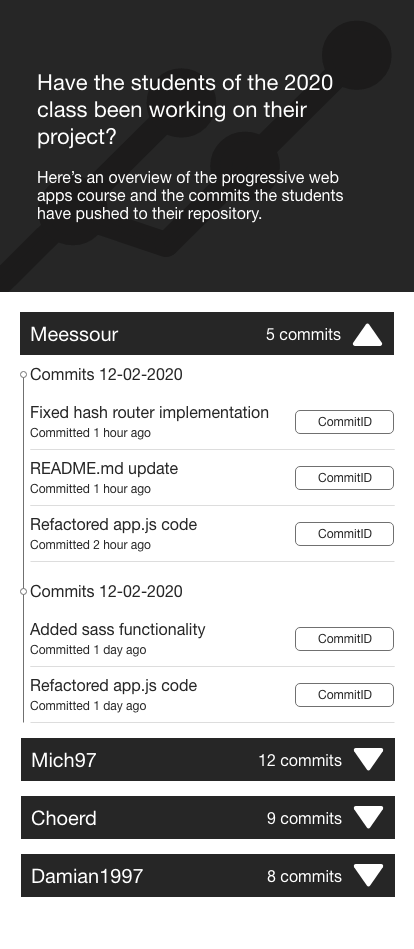

# Progressive Web Apps @cmda-minor-web · 2019-2020
Repository for the progressiive web apps course

## Table of contents
* [Description](description)
* [Concept](concept)
* [Api](api)
* [Prerequisites](prerequisites)
* [Installing](installing)

## Description
During this course i will be converting my client side webside that i build for the [web-app-from-scratch](https://github.com/damian1997/web-app-from-scratch-1920) course to a serverside rendered web application.
The coals of this course is to add as much optimisations to the application to make it run more smooth and enhance the experience the user gets.

### Application description
With this application you can see what the students have worked on based on their commits they made to their forked repository of this course.

## Concept
This web app gives you an insight into how the students have been working on their project and how they structure their commits. The user will be able
to see what changes the student has made to their files for each commit.

<details>
<summary>Designs</summary>




</details>

## Api
This project makes use of the following Api
* [Github Api V3](https://developer.github.com/v3/)

### Rate limiting
For API requests using Basic Authentication or OAuth, you can make up to 5000 requests per hour. Authenticated requests are associated with the authenticated user, regardless of whether Basic authentication For API requests using Basic Authentication or OAuth, you can make up to 5000 requests per hour. Authenticated requests are associated with the authenticated user, regardless of whether Basic Authentication or an [OAuth](https://developer.github.com/v3/#oauth2-token-sent-in-a-header) was used.

For unauthenticated requests, the rate limit allows for up to 60 requests per hour. Unauthenticated requests are associated with the originating IP address, and not the user making requests.

#### Used authentication
This project currentcly fetched data with unauthenticates requests.

## Prerequisites
* Nodejs
* NPM

## Installing
Clone repository into local directory
```
git clone https://github.com/damian1997/progressive-web-apps-1920.git
```

Install packages
```
npm install
```

Run local server
```
npm run dev
```
