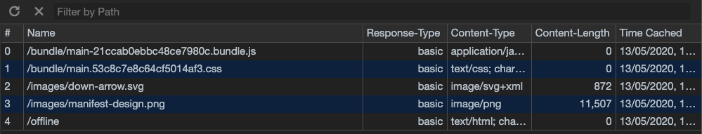

# Progressive Web Apps @cmda-minor-web · 2019-2020
Repository for the progressiive web apps course

## Table of contents
* [Description](description)
* [Concept](concept)
* [Optimizations](optimizations)
* [Api](api)
* [Prerequisites](prerequisites)
* [Installing](installing)

## Description
During this course i will be converting my client side webside that i build for the [web-app-from-scratch](https://github.com/damian1997/web-app-from-scratch-1920) course to a serverside rendered web application.
The coals of this course is to add as much optimisations to the application to make it run more smooth and enhance the experience the user gets. We will do this by
implementing:
* Server side rendering
* Optimizing the critical render path
* Service Workers
* Manifests
* Compression
* Loading Javascript inside the head using defer to make it non-blocking

### Application description
With this application you can see what the students have worked on based on their commits they made to their forked repository of this course.

## Concept
This web app gives you an insight into how the students have been working on their project and how they structure their commits. The user will be able
to see what changes the student has made to their files for each commit.

<details>
<summary>Designs</summary>

**Desktop design overviewpage**


**Mobile designs**


</details>

## Optimizations
I first started of by doing a audit on the web-app-from-scratch application to see what point we are starting off from.

<details>
<summary>Web-app-from-scratch audit</summary>
As you can see from the image below the application functions terribly and has really low scores across the board. So we have a long way to go.

</details>

### Server side rendering
I started of by refactoring my project to be able to be rendered from the server, in the web-app-from-scratch course i rendered the whole application from the browser using a virtual dom and diffing algorithm.
What i noticed is that my api does not like the amount of fetches i need to do in order to get the data i need, so i made a prebuild data fetching script that writes the data into a file on the server so i dont have to
keep asking the api for the information i need.

<details>
<summary>Audit after refactoring to server side</summary>
As you can see from the image below the scores look really promising, but this is to be expected because there is no styling or javascript loading in yet.

</details>

### Styling and javascript minimization
Now it is time to start adding the styling. To minimize the size of the css and javascript files I will be using webpack. By minimizing the files through webpack you will remove
all the whitespace and comments. Webpack can also do a lot of other optimizations such a tree shaking where it checks if there is any redundant imports inside your javascript and will
remove those redundant pieces of code to decrease the bundle size.

<details>
<summary>Audit and network tab after implementing styling</summary>


</details>

### Gzip compression
Gzip compression for express is a middleware that decreases the size of the response body. This will increase the speed of the application, this wont be that much because its a small
application but it is really easy to implement.

<details>
<summary>Network tab after implementing gzip compression</summary>
When you compare the network tab after gzip implementation you see a 1ms improvement when rendering the page for the first meaningful paint.

</details>

### Caching with service workers
For this project we implemented service workers, with service workers you can give your users a rich offline experience and do background syncrsynchronisation
aswell as caching and pushing notifications to the user.

The main reason why i implemented a service worker is to cache webpages and assets to make the page load faster if it has already been visited.
<details>
<summary>Caching core assets</summary>
As you can see my styling has been cached alonside my javascript and images. I also have a page called offline inside the cache so if the user has trouble with his connection
and tries to go onto a page he has not visited before he will see a page with information about his internet connection. The reason we do this is to prevent the user from
looking at a empty screen.


</details>

#### Problems with caching html pages
As mentioned before i use webpack for minifying my css and javascript, when compiling i let webpack put a hash inside the name for the css and js file
(hash is based on content of the file). This makes wil ensure the correct stylesheet is always loaded and not some older version snuck into the application.
In order to get this working i had to use some packages:
* [Serviceworker webpack plugin](https://www.npmjs.com/package/serviceworker-webpack-plugin)
* [Webpack manifest plugin](https://www.npmjs.com/package/webpack-manifest-plugin)

With these 2 packages implemented i now have access to the up to date names of the css an js file i need inside my service worker, i need this to be able to cache them.
But somehow somewhere when implementing these 2 packages i lost the ability to cache my html pages, i have not found out what causes this problem but i think it has
something to do with the serviceworker webpack plugin compiling my serviceworker the wrong way. Caching my html pages worked perfectly before implementing these 2 packages.

<details>
<summary>Caching before implementing 2 packages</summary>
As you can see in these images below i was able to cache my html pages before implementing the 2 packages, but not able to cache the css and js.


</details>

## Api
This project makes use of the following Api
* [Github Api V3](https://developer.github.com/v3/)

### Rate limiting
For API requests using Basic Authentication or OAuth, you can make up to 5000 requests per hour. Authenticated requests are associated with the authenticated user, regardless of whether Basic authentication For API requests using Basic Authentication or OAuth, you can make up to 5000 requests per hour. Authenticated requests are associated with the authenticated user, regardless of whether Basic Authentication or an [OAuth](https://developer.github.com/v3/#oauth2-token-sent-in-a-header) was used.

For unauthenticated requests, the rate limit allows for up to 60 requests per hour. Unauthenticated requests are associated with the originating IP address, and not the user making requests.

#### Used authentication
This project currentcly fetched data with unauthenticates requests.

## Prerequisites
* Nodejs
* NPM

## Installing
Clone repository into local directory
```
git clone https://github.com/damian1997/progressive-web-apps-1920.git
```

Install packages
```
npm install
```

Run local server
```
npm run dev
```
